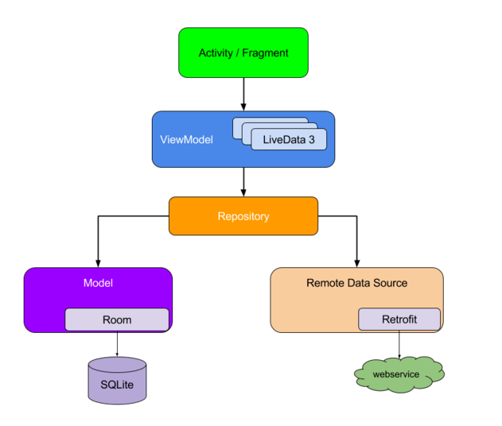

# 家长端架构说明

---
## 1 项目基础配置

- 包名：`com.gwchina.lssw.parent`
- 最低兼容系统：sdk 19
- 屏幕适配基准：适配主流机型

---
## 2 基础架构

### 2.1 UI 架构

**单 Activity + 多 Fragment UI 模块架构**，应用分为多个业务模块，单独模块使用单 Activity+ 多 Fragment 架构，Activity 仅仅作为容器，它管理多个 Fragment 之间的交互，Fragment 作为具体的 View 实现，但是需要谨慎处理 Fragment 的生命周期。防止内存泄露、状态丢失等问题的发生。

### 2.2 MVVM 展示层架构

- Jetpack：Google官方架构组建库，包括 livedata、viewmodel、navigation 等模块。
- Databinding：Google官方数据绑定库。



说明：

- Fragment 作为 View 的实现。
- View 通过观察 ViewModel 提供的可观测数据 LiveData 来响应数据状态。
- ViewModel 与下层的 model 进行交互，
- model 层采用 Repository 模式，封装具体业务调度，包含本地数据与网络数据的获取与存储。为上层提供数据。


### 2.3 Model 层设计

- Data 层是具体的业务调度实现，包括数据的存储和获取。
- 数据模型划分，针对复杂的业务场景和复杂的业务数据模型，需要进行必要的转换后再给到 UI。具体可以划分出以下模型：
  - Model：DTO，服务器传递过来的数据
  - Request：向服务器请求的数据
  - Entity：数据库实体
  - VO：视图对象，服务于 UI
  - Info：组件(Activity)间界面间传递信息
  
**Model 层如何设计统一的异常机制**：RxJava 可以很优雅的处理异步交互与数据流的变换， Model 中的大部分操作都是异步的，使用 RxJava 是理想的选择。在 RxJava 的规范中，对于一个事件流，订阅者始终会收到完成或者错误的通知，且这两个通知是互斥的，onCompleted 表示事件正常结束，onError 表示事件在传递的过程中发生了错误。Mode 层可以把诸如网络错误、服务器错误、客户端错误等分类划分为各种异常，以异常机制通知观察者事件的错误以及错误类型与信息。RxJava 统一了各种异步操作的结果处理。

具体的异常类型划分：

- 网络异常：一般情况下业务操作都需要有网络访问，网络是不稳定的，网络异常情况可以归为一类。
- 服务器异常：服务器可能存在一些未知的bug，当调用某个api是就可能造成服务器异常，导致返回空数据等。
- 本地异常：如何网络权限，本地存储读写权限等异常。
- 业务异常：调用某一个API返回结果，但是业务流程上是失败的，比如密码错误、支付失败等，可以根据各模块业务定义业务相关异常和全局业务异常。


**数据解析时的容错处理**：在开发中我们一般都会选用自动解析框架，比如 Gson，但是使用框架也有一些问题，比如 json 中的某一个字段解析出错就会导致整个数据模型解析出错，如果能够做一些容错处理，则能提高程序的可用性，使用 Gson 我们可以注册自定义的解析器来做容错处理，参考下面代码：

```java
            Gson sGson = new GsonBuilder()
            .excludeFieldsWithModifiers(Modifier.TRANSIENT)
            .excludeFieldsWithModifiers(Modifier.STATIC)
            .registerTypeAdapter(String.class, (JsonDeserializer<String>) (json, typeOfT, context) -> {
                try {
                    return json.getAsString();
                } catch (Exception e) {
                    System.out.println("StringJsonDeserializer-deserialize-error:" + (json != null ? json.toString() : ""));
                    return null;
                }
            })
            .registerTypeAdapter(Unit.class, (JsonDeserializer<Unit>) (src, typeOfSrc, context) -> Unit.INSTANCE)
            .registerTypeAdapter(Void.class, (JsonDeserializer<Void>) (src, typeOfSrc, context) -> null)
            .create();
```

---
## 3 组件化

- 业务组建：`module_{moduleName}}`；包名：`com.gwchina.module.{moduleName}`
- 业务组建可独立运行
- sdk：`lib_{libName}`；包名：`com.gwchina.sdk.{libName}`

### 业务组件划分

- app :主工程
- module_base：所有业务组建的基础库，提供基础业务的封装和整合 sdk
- module_account：账户，包括登录、注册、找回密码。
- module_home：主页面
    - 首页
    - 日记
    - 我的
- module_guard：守护，包括事件守护、应用守护、网址守护、亲情号码、守护级别设置。
- ...：其他模块

### sdk

sdk 所提供的功能是与业务无关的、通用的。

- lib_base：通用库（BaseActivity、BaseFragment等基类封装）
- lib_qrcode：二维码
- lib_player：播放器
- lib_media_selector：选择(图片、视屏文件)、裁剪图片、压缩图片
- lib_social：第三方登录、分享
- lib_pay：第三方支付基础类库集成与封装（与业务无关的）
- lib_widget：其他 UI 组件
- lib_xxx：其他功能 sdk

### lib_base 具体说明

lib_base 作为顶层的 Android 基类架构库，作为一个 Module 而独立存在，其不依赖于其他 Module。也不包含具体的业务，而是提供高可扩展低侵入性的功能：

- Activity基类：公共行为封装
- Fragment基类：公共行为封装
    - 显示通用的LoadingDialog和Message
    - 状态布局的切换(Content、Error、Loading、Empty)，同时支持个性化配置
    - List界面的行为封装：Refresh和LoadMore
- Adapter封装
- 通用的工具类集合
- 权限申请适配
- Log库，使用 Timber 作为日志接口
- 图片加载框架(Glide)
- 网络状态的监控
- App生命周期的监控
- 缓存方案：提供 Key Value 级别的基础缓存实现

---
## 4 开源库选型

### 4.1 开源库列表

- IOC框架：Dagger2 + Dagger2-Android
- ReactX：RxJava、RxLifecycle
- 事件总线：RxBus（使用RxJava实现事件通知）
- 网络库：Retrofit + OkHttp + RxJava
- 图片加载：Glide
- 路由：[ARouter](https://github.com/alibaba/ARouter)
- 缓存库：[MMKV](https://github.com/Tencent/MMKV/blob/master/readme_cn.md)
- 数据库：Room
- 日志库：[Timber](https://github.com/JakeWharton/timber)、logger（Timer为调用接口，logger为接口实现）
- 扫码：zxing
- 播放器：ijkplayer
- 图表：MPAndroidChart 、hellocharts-android
- 地图/定位：高德地图
- 支付：微信、支付宝（单个集成）
- 分享/第三方登录：[ShareSDK](http://www.mob.com/download)
- IM：环信
- 埋点统计分析：友盟统计
- 推送：极光推送
- 热修复：Tinker
- 升级：Bugly支持全量更新和热更新，热更新基于Tinker
- Crash收集：Bugly
- 热部署：待定

### 4.2 使用原则

开源库使用原则：业务模块尽量不直接依赖第三方依赖库 API，而是自己抽象出调度接口，由具体的库实现。

### 4.3 Dagger2 说明

我们可以这样理解：一个 Android 应用最基本的就是 Activity 和 Fragment 等组件，我们使用这些原生组件来创建不同的应用，但是如果没有云端数据，那么这个应用就是死的，所以  Activity 和 Fragment 等组件就需要 Presenter 或 ViewModel 对象了（同样 Presenter 或 ViewModel 还需要依赖其他具体功能），那么如何让 Activity 和 Fragment 等组件持有这些对象呢？最直接的方法就是直接在 Activity 和 Fragment 等组件中 new 出来，但是这样不仅使程序变得复杂，还产生了强耦合了，即 Activity 和 Fragment 等组件需要关心 Presenter 或 ViewModel 是怎么创建的，而且它们依赖的也是具体的  Presenter 或 ViewModel。

这样做扩展性不够好，程序不够灵活，所以我们需要把  Presenter 或 ViewModel 等扩展的创建抛出去， Activity 和 Fragment 等组件只关心怎么使用它们，而不需要关心怎么创建它们，于是就有了 Dagger2 了。容器，Dagger2 类似于 Spring 容器，Dagger2 提供项目级的依赖注入，可以说是解耦神器。

Dagger2 提供了以下两个功能：

- 依赖注入
- 依赖的生命周期管理

### 4.4 事件总线

大量使用事件总线会造成方法调用链追踪困难，业务逻辑混乱，所以尽量不要使用。如果需要使用，则尽量以组件为范围，组件之间通过下沉到  base  的接口进行通信。

---
## 5 UI设计

以下信息应该由 UI 提供：

- UI 设计规范色系
- UI 设计规范通用尺寸
- UI 设计规范通用字体与字体大小

建议：

- 确认 app 主色调，以及 app 色调范围。
- 规范一些通用的尺寸，如内容区域与屏幕边缘距离、行距等。
- 规范字体与字体大小。